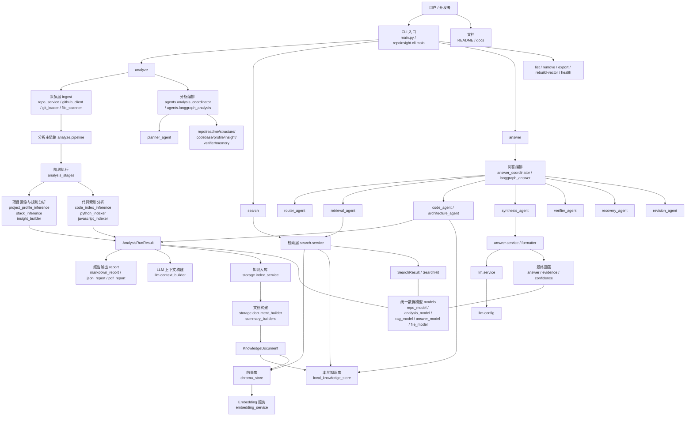
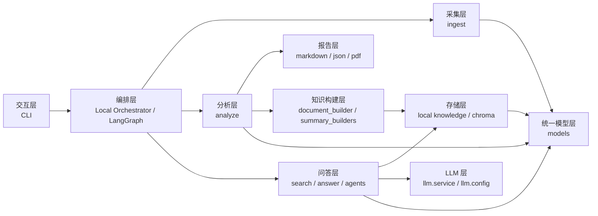

<div align="center">

# RepoInsight

### 面向 GitHub 仓库的本地分析、检索与问答工具

输入仓库 URL，自动完成仓库采集、代码分析、结构化报告生成、知识入库与后续问答。


</div>

---

## 为什么是 RepoInsight

很多 GitHub 仓库你分析过一次，过几天就忘了。  
RepoInsight 想解决的是：

- 不是只做“一次性分析”
- 而是把分析结果沉淀为“可检索、可复用、可继续问答”的本地知识资产

它更像你的一个「开源项目第二大脑」：

- 先 `analyze`
- 再 `search`
- 然后继续 `answer`

---

截至 2026-04-17，本地最近一次全量测试结果：

- `python -B -m pytest -q`
- `122 passed, 1 warning`

当前可用性判断：

| 能力 | 状态 | 说明 |
|---|---|---|
| 仓库分析 `analyze` | 可用 | 主链路稳定 |
| 本地知识库 / 向量索引 | 可用 | 支持 Chroma + 本地回退 |
| 检索 `search` | 可用 | 跨已分析仓库搜索 |
| 单仓库问答 `answer` | 可用 | 支持抽取式与 LLM 增强 |
| 代码级问答 | 可用 | 已支持函数 / 类 / 路由 / 关系链 |
| 多 Agent 编排 | 可用 | `local` 与 `langgraph` 双路线 |
| Web UI | 未开始 | 暂无正式前端 |
| GraphRAG | 未开始 | 后续方向 |

---

## 核心能力

### 1. 仓库分析

- GitHub 公共仓库元数据获取
- README 获取
- 本地克隆与缓存
- 文件扫描、关键文件识别、目录树预览
- 项目画像、技术栈、项目类型、优势 / 风险分析
- Markdown / JSON / LLM 上下文 / PDF 报告输出

### 2. RAG 与知识库存储

- 本地知识文档落盘
- Chroma 向量索引
- 本地轻量检索回退
- 向量索引健康检查、重建、孤儿清理

### 3. 问答

- `search`：跨已分析仓库搜索
- `answer`：针对单仓库问答
- 支持 `--no-llm`
- 支持流式输出 / JSON 输出
- 支持代码实现类问题的代码级证据追踪

### 4. 多 Agent 编排

- `answer` 侧：多 Agent 已较完整
- `analyze` 侧：已有 `planner_agent`、动态任务裁剪、任务卡片、并行波次雏形
- 支持 `local` / `langgraph` 双编排器

### 5. 本地模型支持

- Embedding：`service` / `ollama` / `sentence-transformers`
- LLM：兼容服务商 API，也支持本地 Ollama

---

## 当前最成熟的语言支持

目前做得最完整的是：

- Python
- JavaScript / TypeScript

其他方向已预留基础识别与扩展入口：

- Go
- Java
- Rust
- PHP
- Ruby
- C#

---

## 安装

### 环境要求

- Python `>= 3.14`

### 推荐安装方式

```bash
python -m venv .venv
.venv\\Scripts\\activate
pip install -e .
```

如果你使用 `uv`，也可以按自己的习惯安装。

---

## 配置

先复制环境变量模板：

```bash
copy .env.example .env
```

### 常用配置项

#### Embedding

- `REPOINSIGHT_EMBEDDING_PROVIDER`
- `REPOINSIGHT_EMBEDDING_MODEL`
- `REPOINSIGHT_EMBEDDING_BASE_URL`
- `REPOINSIGHT_EMBEDDING_API_KEY`

#### LLM

- `REPOINSIGHT_LLM_PROVIDER`
- `REPOINSIGHT_LLM_MODEL`
- `REPOINSIGHT_LLM_BASE_URL`
- `REPOINSIGHT_LLM_API_KEY`

### Ollama 示例

```env
REPOINSIGHT_LLM_PROVIDER=ollama
REPOINSIGHT_LLM_MODEL=qwen2.5:7b
REPOINSIGHT_LLM_BASE_URL=http://127.0.0.1:11434
REPOINSIGHT_LLM_API_KEY=ollama
```

---

## 快速开始

### 1) 分析一个仓库

```bash
python main.py analyze https://github.com/langchain-ai/langgraph
```

可选用法：

```bash
python main.py analyze https://github.com/langchain-ai/langgraph --orchestrator local
python main.py analyze https://github.com/langchain-ai/langgraph --orchestrator langgraph
python main.py analyze https://github.com/langchain-ai/langgraph --embedding-mode ollama
python main.py analyze https://github.com/langchain-ai/langgraph --no-save-report
```

### 2) 搜索已分析知识

```bash
python main.py search "哪些项目用了 FastAPI"
```

### 3) 针对单仓库提问

```bash
python main.py answer langchain-ai/langgraph "这个项目是做什么的？"
```

实现类问题示例：

```bash
python main.py answer langchain-ai/langgraph "路由注册是怎么实现的？" --no-llm
```

### 4) 管理本地知识库与向量索引

```bash
python main.py list
python main.py remove langchain-ai/langgraph
python main.py remove-vector langchain-ai/langgraph
python main.py rebuild-vector
python main.py vector-health
python main.py embedding-health
python main.py cleanup-orphans
```

### 5) 导出报告

```bash
python main.py export langchain-ai/langgraph --format pdf
```

---

## 主要命令

| 命令 | 说明 |
|---|---|
| `analyze` | 分析仓库并生成报告 |
| `search` | 跨知识库搜索 |
| `answer` | 针对单仓库问答 |
| `list` | 列出已缓存仓库 |
| `remove` | 删除本地仓库缓存，可选删除关联报告 |
| `remove-vector` | 仅删除向量索引中的仓库数据 |
| `rebuild-vector` | 从本地知识文档重建向量库 |
| `vector-health` | 检查向量库状态 |
| `embedding-health` | 检查 embedding 服务状态 |
| `cleanup-orphans` | 清理孤儿报告 / 知识文档 / 向量索引 |
| `export` | 导出报告 |
| `version` | 查看版本 |

---

## 项目架构图

### 总体架构



### 分层视图



### 架构说明

- 交互层：通过 CLI 触发 `analyze`、`search`、`answer` 和仓库管理命令
- 编排层：支持本地编排和 LangGraph 编排，两套链路并存
- 分析层：负责仓库采集、规则分析、代码索引、项目画像与报告生成
- 存储层：负责本地知识文档和 Chroma 向量索引
- 问答层：负责检索、代码调查、回答生成与多 Agent 校验
- 模型层：统一承载 repo、analysis、rag、answer 等核心数据结构

---

## 多 Agent 说明

### analyze 侧

当前分析链路已支持：

- `planner_agent`
- `repo_agent`
- `readme_agent`
- `structure_agent`
- `codebase_agent`
- `profile_agent`
- `insight_agent`
- `verifier_agent`
- `memory_agent`

并且已经具备：

- 动态任务裁剪
- 任务卡片
- 角色依赖
- 并行波次元数据
- `local` / `langgraph` 双编排器

### answer 侧

当前问答链路已支持：

- `router_agent`
- `retrieval_agent`
- `code_agent`
- `synthesis_agent`
- `verifier_agent`
- `recovery_agent`
- `revision_agent`

---

## 当前推荐使用方式

如果你是第一次使用，建议按这个顺序来：

1. `python main.py analyze <GitHub URL>`
2. `python main.py answer <owner/repo> "这个项目是做什么的？" --no-llm`
3. `python main.py search "你的问题"`
4. 再按需切换：
   - `--embedding-mode ollama`
   - `--orchestrator langgraph`
   - LLM 配置

---


## 后续方向

- GraphRAG
- Web UI
